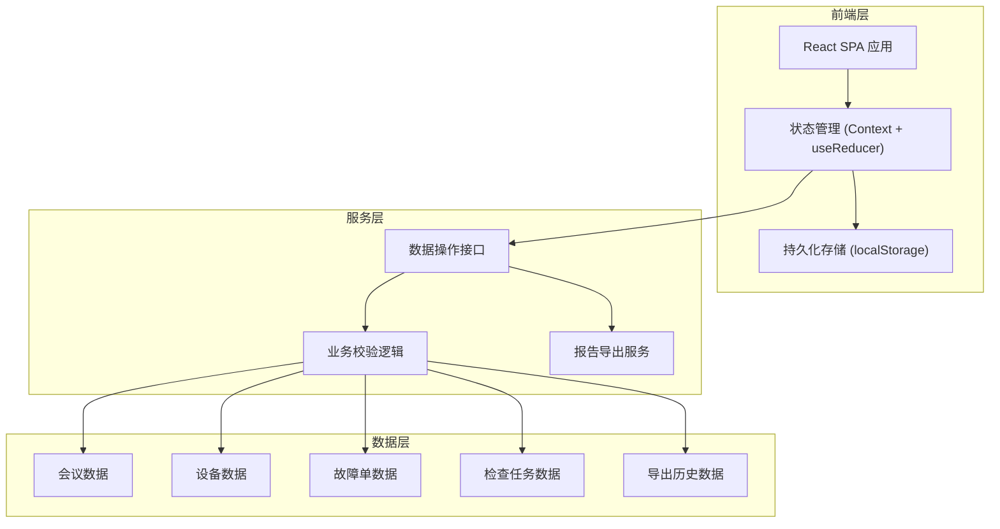
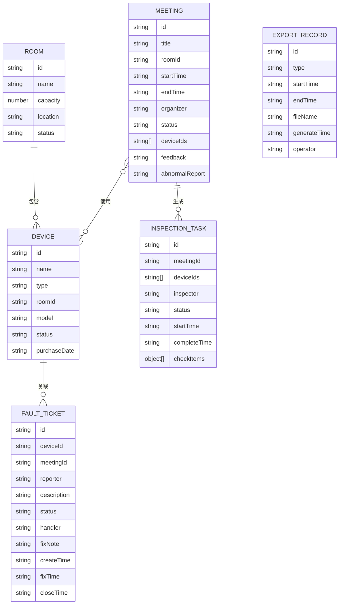

## 1. 架构设计



## 2. 技术描述

- 前端: React@18 + TypeScript + Vite
- UI框架: Tailwind CSS@3 + Lucide React Icons
- 状态管理: React Context + useReducer
- 数据持久化: localStorage (模拟后端数据库)
- 日期处理: date-fns
- 文件导出: 自定义CSV导出工具

## 3. 路由定义

| 路由 | 用途 |
|------|------|
| / | 设备状态墙（首页） |
| /calendar | 会议日历 |
| /meetings | 会议列表 |
| /meetings/create | 创建会议 |
| /devices | 设备管理 |
| /inspections | 检查任务列表 |
| /faults | 故障报修列表 |
| /reports | 报告导出 |

## 4. 数据模型

### 4.1 数据模型定义



### 4.2 数据定义

#### 会议室 (Room)
```typescript
interface Room {
  id: string;
  name: string;
  capacity: number;
  location: string;
  status: 'normal' | 'maintenance';
}
```

#### 设备 (Device)
```typescript
interface Device {
  id: string;
  name: string;
  type: 'projector' | 'speaker' | 'access' | 'network';
  roomId: string;
  model: string;
  status: 'normal' | 'fault' | 'maintenance';
  purchaseDate: string;
}
```

#### 会议 (Meeting)
```typescript
interface Meeting {
  id: string;
  title: string;
  roomId: string;
  startTime: string;
  endTime: string;
  organizer: string;
  status: 'scheduled' | 'in_progress' | 'completed' | 'cancelled';
  deviceIds: string[];
  feedback?: string;
  abnormalReport?: string;
}
```

#### 检查任务 (InspectionTask)
```typescript
interface CheckItem {
  deviceId: string;
  deviceName: string;
  checked: boolean;
  normal: boolean;
  remark?: string;
}

interface InspectionTask {
  id: string;
  meetingId: string;
  deviceIds: string[];
  inspector: string;
  status: 'pending' | 'in_progress' | 'completed' | 'failed';
  startTime: string;
  completeTime?: string;
  checkItems: CheckItem[];
}
```

#### 故障单 (FaultTicket)
```typescript
interface FaultTicket {
  id: string;
  deviceId: string;
  meetingId?: string;
  reporter: string;
  description: string;
  status: 'open' | 'processing' | 'fixed' | 'closed';
  handler?: string;
  fixNote?: string;
  createTime: string;
  fixTime?: string;
  closeTime?: string;
}
```

#### 导出记录 (ExportRecord)
```typescript
interface ExportRecord {
  id: string;
  type: 'device_usage' | 'inspection' | 'fault' | 'comprehensive';
  startTime: string;
  endTime: string;
  fileName: string;
  generateTime: string;
  operator: string;
}
```

## 5. 核心业务校验逻辑

### 5.1 设备占用校验
- 查询该设备在目标时间段内是否已被其他会议占用
- 状态为 `scheduled` 或 `in_progress` 的会议占用生效

### 5.2 设备故障校验
- 设备 `status === 'fault'` 时不可分配
- 存在未关闭故障单（状态非 `closed`）时不可分配

### 5.3 会议开始校验
- 关联检查任务状态必须为 `completed`
- 所有检查项 `checked === true` 且 `normal === true`

### 5.4 临时换房校验
- 新会议室必须在目标时间段可用
- 新会议室中包含原会议勾选的所有设备类型，或自动替换为新会议室对应设备

## 6. 数据初始化

系统首次启动时自动初始化以下模拟数据：
- 4个会议室（大/中/小型各一，含多功能厅）
- 每间会议室配备投影、音响、门禁、网络设备各一
- 预设2-3个历史会议记录
- 预设1个待处理故障单
